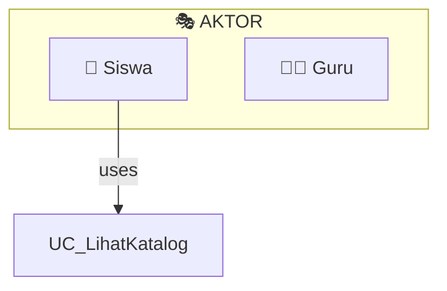

# 📊 Panduan Penggunaan Use Case Diagram

**Sistem Manajemen SARPRAS**  
**Tanggal: 8 Februari 2026**

---

## 📁 File-File yang Tersedia

Kami tersediakan 3 format diagram yang dapat Anda gunakan sesuai kebutuhan:

### 1. **HTML Interactive Viewer** (Rekomendasi!)
- **File:** `use-case-diagram-viewer.html`
- **Cara Buka:** Double-click file atau buka di browser
- **Fitur:**
  - ✅ Diagram interaktif langsung terlihat
  - ✅ Tab untuk melihat Diagram, Dokumentasi, dan Kode
  - ✅ Tombol Download, Print, Fullscreen
  - ✅ Tidak perlu software tambahan
  - ✅ Bisa dibuka di semua browser modern

**Cara Menggunakan:**
```
1. Buka file: use-case-diagram-viewer.html
2. Lihat diagram di tab "Diagram"
3. Baca dokumentasi di tab "Dokumentasi"
4. Lihat kode di tab "Kode Diagram"
5. Download atau print sesuai kebutuhan
```

---

### 2. **PlantUML Format** (Untuk Dokumen Professional)
- **File:** `use-case-diagram.puml`
- **Tool yang Dibutuhkan:** PlantUML, Visual Studio Code + Extension, atau Editor Online
- **Fitur:**
  - ✅ Format standar industri untuk diagram UML
  - ✅ Dapat diintegrasikan ke dokumentasi teknis
  - ✅ Support untuk lebih banyak customization

**Cara Menggunakan:**

#### Opsi A: PlantUML Web Editor (Paling Mudah)
```
1. Buka: https://www.plantuml.com/plantuml/uml/
2. Klik "Open" 
3. Pilih file use-case-diagram.puml
4. Diagram akan ter-render otomatis
5. Bisa export ke berbagai format (PNG, SVG, PDF, dll)
```

#### Opsi B: VS Code dengan Extension
```
1. Install VS Code (jika belum)
2. Install extension: PlantUML (oleh jebbs)
3. Buka file use-case-diagram.puml
4. Klik kanan → "Preview Current Diagram"
5. Diagram muncul di preview pane
```

#### Opsi C: Integrasi ke Markdown
```markdown
Jika menggunakan GitHub atau Markdown docs:

​```puml
@startuml
' Paste kode dari use-case-diagram.puml
@enduml
​``` 
```

---

### 3. **Mermaid Format** (Untuk GitHub & Docs)
- **File:** `use-case-diagram.mmd`
- **Tool yang Dibutuhkan:** GitHub, GitLab, atau Platform yang support Mermaid
- **Fitur:**
  - ✅ Native support di GitHub README
  - ✅ Gratis dan open-source
  - ✅ Mudah di-embed di dokumentasi online

**Cara Menggunakan:**

#### Opsi A: Di GitHub README
```markdown
# Sistem Manajemen SARPRAS

## Use Case Diagram


```

#### Opsi B: Online Mermaid Editor
```
1. Buka: https://mermaid.live/
2. Copy-paste isi file use-case-diagram.mmd
3. Diagram akan ter-render secara real-time
4. Export ke SVG atau PNG
```

#### Opsi C: VS Code dengan Extension
```
1. Install extension: Markdown Preview Mermaid Support
2. Buka file use-case-diagram.mmd
3. Preview otomatis ter-render
```

---

## 🎯 Cara Membaca Use Case Diagram

### Elemen Diagram

```
┌─────────────┐
│   SISWA     │  ← Aktor (Actor) - Pihak yang berinteraksi
└─────────────┘
       │
       │ uses
       ↓
    ┌─────────────────────┐
    │ Ajukan Peminjaman   │  ← Use Case - Fungsionalitas
    └─────────────────────┘
       │
       │ includes
       ↓ (harus ada)
    ┌─────────────────────┐
    │ Upload Foto         │  ← Dependent Use Case
    └─────────────────────┘
```

### Simbol-Simbol

| Simbol | Nama | Arti |
|--------|------|------|
| 🎭 (Stick Figure) | Actor | Pengguna atau sistem eksternal |
| 🟢 (Oval) | Use Case | Fungsionalitas/aksi dalam sistem |
| ━━> | Association | Hubungan direct antara aktor & use case |
| ⋯⋯> | Include | Use case selalu dijalankan bersama |
| ⋯⋯> | Extend | Use case optional/conditional |
| ▢ | Subsystem | Kelompok use case terkait |

---

## 📚 Interpretasi Use Case Diagram SARPRAS

### Aktor dan Tanggungjawab

```
👤 SISWA
├─ Lihat Katalog Barang
├─ Ajukan Peminjaman (includes: Upload Foto)
├─ Lihat Status Peminjaman
├─ Kembalikan Barang
├─ Lapor Kerusakan
└─ Lihat Riwayat

👨‍🏫 GURU (extends Siswa + Approval)
├─ [Semua dari Siswa] +
├─ Persetujuan Peminjaman
├─ Lihat Laporan Kerusakan
└─ Lihat Dashboard

🔧 PETUGAS SARPRAS
├─ Tambah Barang
├─ Edit Barang
├─ Hapus Barang
├─ Validasi Peminjaman
├─ Catat Pengambilan (includes: Upload Foto)
├─ Catat Pengembalian (includes: Upload Foto)
├─ Verifikasi Kerusakan
├─ Respons Pengaduan
├─ Buat Maintenance Record
├─ Update Status Maintenance
├─ Update Kondisi Barang
├─ Manage Kategori
├─ Manage Ruang
└─ Lihat Dashboard

👨‍💼 ADMIN
├─ [Semua dari Petugas] +
├─ Manage User (includes: Assign Role, Aktivasi User)
├─ Berikan Peringatan
├─ Lihat Activity Log
└─ Lihat Dashboard Lengkap
```

---

## 🔍 Analisis Use Case Penting

### 1. Use Case: **Ajukan Peminjaman**
```
Aktor Primary: Siswa, Guru
Aktor Secondary: Petugas, Admin
Include: Upload Foto (optional dalam reality)
Pre-condition: 
  - User sudah login
  - Barang tersedia dalam stok
Post-condition:
  - Permintaan peminjaman tercatat
  - Status = "menunggu"
Main Flow:
  1. Siswa lihat katalog barang
  2. Pilih barang & tentukan jumlah
  3. Isi tujuan penggunaan
  4. Upload foto (opsional)
  5. Submit permintaan
  6. Sistem catat permintaan
  7. Notifikasi ke Petugas/Guru
```

### 2. Use Case: **Persetujuan Peminjaman**
```
Aktor: Guru, Petugas, Admin
Pre-condition:
  - Ada permintaan peminjaman dengan status "menunggu"
  - Petugas/Guru sudah login
Flow:
  1. Guru/Petugas melihat daftar permintaan tertunda
  2. Review detail permintaan:
     - Barang apa?
     - Dari siswa siapa?
     - Untuk keperluan apa?
     - Stok cukup?
  3. Setujui atau Tolak
  4. Jika setujui: status = "disetujui"
  5. Jika tolak: status = "ditolak" + alasan
  6. Notifikasi ke peminjam
```

### 3. Use Case: **Lapor Kerusakan** → **Buat Maintenance**
```
Aktor: Siswa/Guru (Lapor)
Aktor: Petugas/Admin (Process)

Flow:
  1. Siswa temukan barang rusak
  2. Lapor kerusakan via pengaduan
  3. Berikan deskripsi & foto bukti
  4. Petugas menerima laporan
  5. Verifikasi kerusakan (inspect barang)
  6. Tentukan apakah perlu perbaikan
  7. Jika ya: Buat Maintenance Record
  8. Record mencakup: jenis perbaikan, estimasi biaya, status
  9. Teknisi/Petugas lakukan perbaikan
  10. Update status = "selesai"
  11. Update kondisi barang menjadi "baik"
```

---

## 💡 Tips Presentasi Use Case Diagram

### Untuk Presentasi UKK:

1. **Mulai dari Aktor:**
   - Jelaskan 4 aktor dan perbedaannya
   - Gambarkan tanggung jawab masing-masing
   
2. **Kelompokkan Fungsi:**
   - Tunjukkan subsystem/kelompok use case
   - Jelaskan mengapa dikelompokkan seperti itu
   
3. **Jelaskan Alur Penting:**
   - Focus pada 3 workflow utama:
     1. Peminjaman (Ajukan → Setujui → Catat → Kembalikan)
     2. Kerusakan (Lapor → Verifikasi → Maintenance)
     3. Admin (Manage User, Monitor, Audit)

4. **Highlight Relasi Include/Extend:**
   - Tunjukkan dependensi antar use case
   - Jelaskan mengapa ada hubungan tersebut

5. **Comparison dengan Tabel Akses Kontrol:**
   - Korelasikan dengan dokumen analisis aktor
   - Tunjukkan consistency antara diagram dan tabel

---

## 📥 Download & Export

### Dari HTML Viewer:
- **Button Download:** Simpan diagram sebagai SVG
- **Button Print:** Print ke PDF atau printer fisik
  
### Dari PlantUML:
```bash
# Jika menggunakan PlantUML CLI:
plantuml -Tpng use-case-diagram.puml    # → PNG
plantuml -Tsvg use-case-diagram.puml    # → SVG
plantuml -Tpdf use-case-diagram.puml    # → PDF
```

### Dari Mermaid Online:
- Download sebagai PNG/SVG langsung dari editor
- Copy-paste sebagai Markdown untuk dokumentasi online

---

## 🔗 Tool & Referensi

### Diagram Tools
- **PlantUML Web:** https://www.plantuml.com/plantuml/uml/
- **Mermaid Live:** https://mermaid.live/
- **VS Code Extensions:**
  - PlantUML (jebbs)
  - Mermaid Preview (Markdown Preview Mermaid Support)
  - Draw.io Integration

### Documentasi
- **PlantUML Docs:** https://plantuml.com/
- **Mermaid Docs:** https://mermaid.js.org/
- **UML Use Case:** https://en.wikipedia.org/wiki/Use_case_diagram

---

## ✅ Checklist Presentasi

- [ ] Diagram sudah dibuka dan ter-render dengan baik
- [ ] Semua aktor dan use case terlihat jelas
- [ ] Dapat menjelaskan relationship yang ada
- [ ] Bisa menjawab pertanyaan tentang alur (flow) masing-masing use case
- [ ] Dapat korelasikan diagram dengan analisis aktor
- [ ] File backup sudah disiapkan (PLN mati, dll)
- [ ] Print version sudah disiapkan jika diminta

---

## 📚 Dokumen Terkait

Untuk kelengkapan dokumentasi UKK, gunakan juga dokumen berikut:

| Dokumen | Isi |
|--------|-----|
| [flowchart-alur-kerja-viewer.html](flowchart-alur-kerja-viewer.html) | Flowchart alur kerja web (masuk, auth, peminjaman, pengembalian, pengaduan, admin) |
| [flowchart-alur-kerja.mmd](flowchart-alur-kerja.mmd) | Kode Mermaid flowchart |
| [PENJELASAN_ALUR_PROSES.md](PENJELASAN_ALUR_PROSES.md) | Penjelasan singkat alur proses |
| [KETERANGAN_FUNGSI_HALAMAN.md](KETERANGAN_FUNGSI_HALAMAN.md) | Fungsi tiap halaman (format: Halaman X: digunakan untuk …) |
| [README.md](README.md) | Indeks semua dokumentasi di folder docs |

---

## 🚀 Next Steps

1. **Buka file HTML viewer:** `use-case-diagram-viewer.html`
2. **Lihat diagram & dokumentasi**
3. **Buka flowchart:** `flowchart-alur-kerja-viewer.html` untuk alur kerja
4. **Download/Print sesuai kebutuhan**
5. **Presentasikan ke penguji UKK**
6. **Siapkan jawaban untuk pertanyaan lanjutan**

---

**Dokumen ini dibuat untuk mendukung Ujian Kompetensi Keahlian (UKK) 2026**
